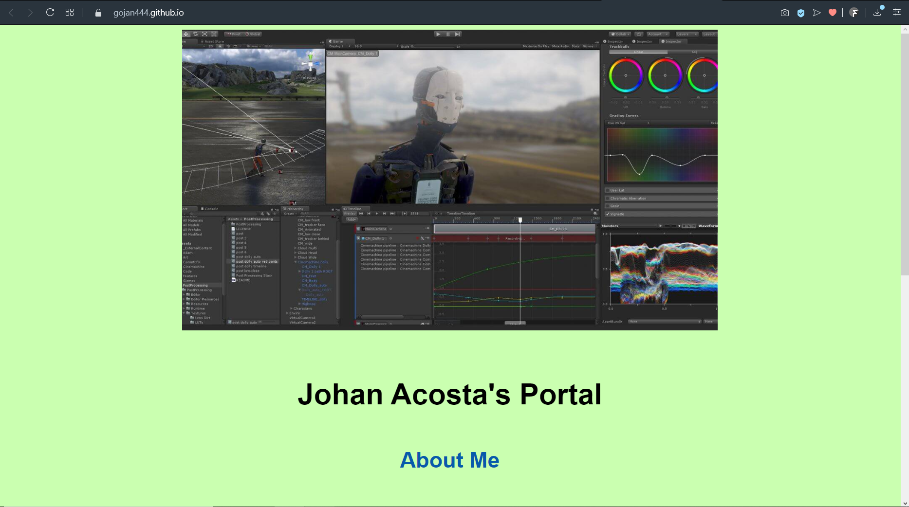
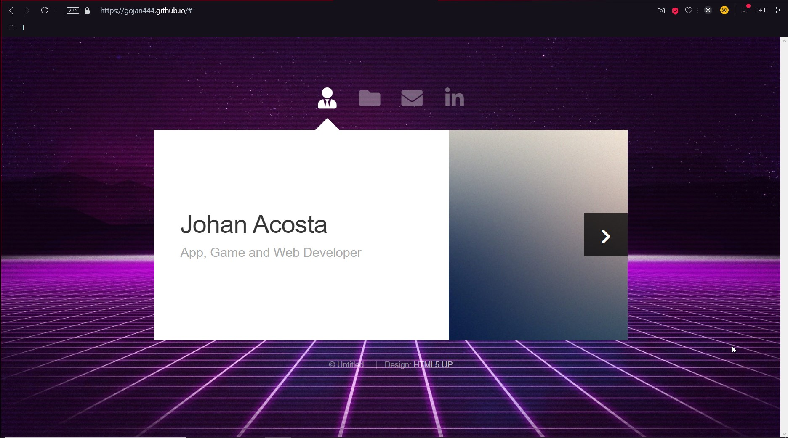

# Gojan444.github.io
## This is my portafolio WebSite on Github
Solo estoy usando esto como ejersisio para aprender Markdown aqui en Github
#### ScreenShot:
##### Asi se ve mi pagina hoy 25/06/2020 
>  Using Markdown:
> ``

> Using `HTML` :
> ``

## UpDate
### 26/06/2020
me gusta la apariencia que va ganado mi pagina

